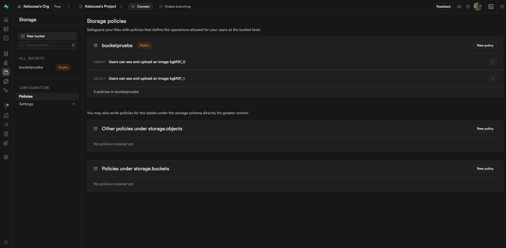

### Persistencia de usuarios autenticados

Para mantener la sesión del usuario autenticado incluso después de recargar la página, pueden usar `localStorage` junto con Firebase Authentication. Aquí tienen una guía que puede ayudarles:

1. **Configura Firebase Authentication**  
    Deben tener hasta este punto Firebase Authentication ya funcionando, recuerden agregar la claves de la API y configurar el proyecto en Firebase Console.

2. **Establece la persistencia de sesión**  
    Antes de autenticar al usuario, configuren la persistencia con:

    ```js
    import { getAuth, setPersistence, browserLocalPersistence, signInWithEmailAndPassword } from "firebase/auth";

    const auth = getAuth();

    // También pueden usar Asyn await aquí
    setPersistence(auth, browserLocalPersistence)
      .then(() => {
         // Ahora puedes iniciar sesión y la sesión se mantendrá en localStorage
         return signInWithEmailAndPassword(auth, email, password);
      })
      .catch((error) => {
         // Maneja errores aquí
         console.error(error);
      });
    ```

3. **Verifica el usuario autenticado**  
    Puedes obtener el usuario autenticado en cualquier momento (incluso después de recargar la página):

    ```js
    import { getAuth, onAuthStateChanged } from "firebase/auth";

    const auth = getAuth();

    onAuthStateChanged(auth, (user) => {
      if (user) {
         // El usuario sigue autenticado
         console.log("Usuario autenticado:", user);
      } else {
         // No hay usuario autenticado
      }
    });
    ```

4. **Cerrar sesión**  
    Para cerrar la sesión y limpiar el localStorage:

    ```js
    import { getAuth, signOut } from "firebase/auth";

    const auth = getAuth();
    signOut(auth);
    ```

**Nota:**  
- `browserLocalPersistence` almacena la sesión en `localStorage`, lo que permite que el usuario siga autenticado incluso después de cerrar y volver a abrir el navegador.
- Varios de los métodos aquí mencionados ya han sido especificados, por lo que si desea modificarlos, puede hacerlo sin problemas.


### Supabase Storage

Para almacenar archivos en Supabase Storage, pueden usar el siguiente código:

```js
  import { supabase } from "./SupabaseConfig";

  const bucketName = "bucketprueba";

  const uploadFile = async (file: File): Promise<string | null> => {
      const { data, error } = await supabase.storage
          .from(bucketName)
          .upload(`Fotos/file_${Date.now()}`, file);

      if (error) {
          console.error("Error uploading file:", error);
          return null;
      }

      console.log("File uploaded successfully:", data);
      return data.path;
  }

  export { uploadFile };
```

Este codigo muestra como crear una función que permite guardar información en Supabase Storage.

**Nota:**
- Asegúrate de que el bucket `bucketprueba` exista en tu proyecto de Supabase.
- Puedes cambiar el nombre del bucket y la ruta del archivo según tus necesidades.
- La función `uploadFile` toma un archivo como argumento y lo sube a Supabase Storage, devolviendo la ruta del archivo subido.
- Recuerda que debes tener configurado el cliente de Supabase (`supabase`) en tu proyecto antes de usar esta función.
- Para que puedas subir imágenes (y no te salte el error 400 bad request) debes asegurar que el bucket tenga la política de acceso correcta. Puedes hacerlo desde la consola de Supabase, en la sección de Storage, seleccionando el bucket y luego configurando las políticas de acceso. Asegúrate de que el bucket tenga permisos públicos o que estés autenticado correctamente para acceder a él.




### Restauración de contraseñas en firebase

Para restaurar la contraseña de un usuario en Firebase Authentication, puedes usar el siguiente código:

```js
const sendPasswordReset = async (email: string) => {
  try {
    await sendPasswordResetEmail(auth, email);
    console.log("Correo de restablecimiento enviado a:", email);
    return { success: true };
  } catch (error) {
    console.error("Error enviando correo de restablecimiento:", error);
    return { success: false, error };
  }
};
```

Este código envía un correo electrónico de restablecimiento de contraseña al usuario con el correo electrónico proporcionado. Asegúrate de que el correo electrónico esté registrado en Firebase Authentication.

Para actualizar la contraseña de un usuario autenticado, puedes usar el siguiente código:

```js
  import { getAuth, updatePassword } from "firebase/auth";

  const changePassword = async (newPassword: string) => {
    const auth = getAuth();
    const user = auth.currentUser;

    if (user) {
      try {
        await updatePassword(user, newPassword);
        console.log("Contraseña actualizada exitosamente.");
        return { success: true };
      } catch (error) {
        console.error("Error actualizando contraseña:", error);
        return { success: false, error };
      }
    } else {
      console.error("No hay usuario autenticado.");
      return { success: false, error: "No autenticado" };
    }
  };
```


### Actividad en clase:

1. Agregar las funcionalidades de actualizar la contraseña (estando autenticado) y restaurar la contraseña (sin estar autenticado) a la aplicación.

2. Crear una función que permita subir imágenes a Supabase Storage y guardar la URL de la imagen en la base de datos.
3. Crear una tabla de usuarios y posts, donde un usuario puede tener varios posts, y cada post solo puede tener una imágen.
   3.1 Crear una página que permita según la busqueda de un usuario, ver todos sus posts.
   3.2 La tabla de post debe contener la url de la imágen que apunte a la imágen subida a Supabase Storage.
   